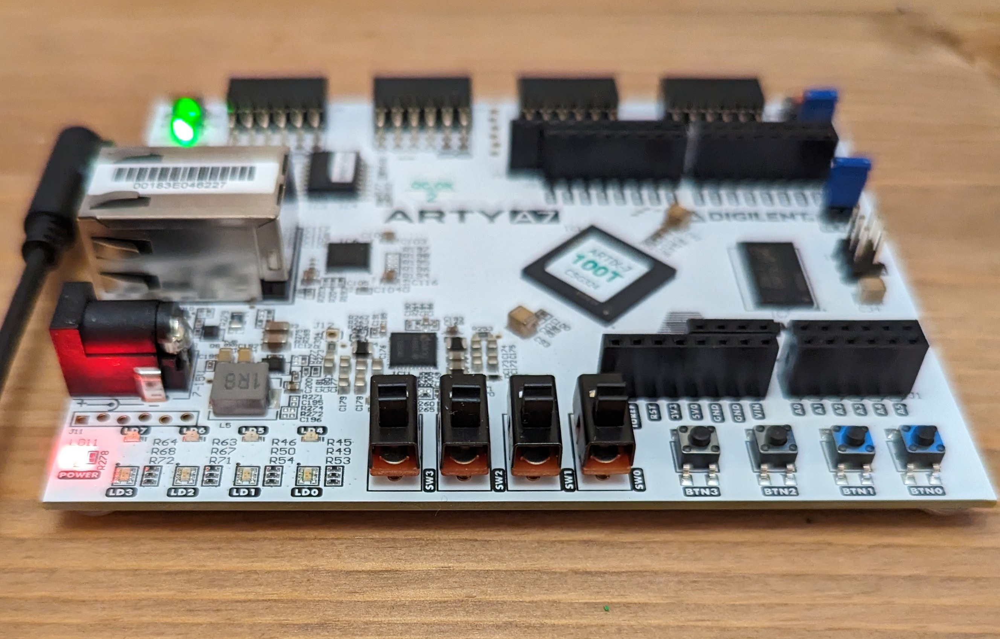

# Project Ganymede

## System Overview 

1. [C Compiler targeted at RISC-V](compiler/README.md)

2. [RISC-V processor](processor/)

3. [RISC-V OS](os/)

4. [ML framework](mlframework/)

## References

1. Compiler

   - [Chibicc](https://github.com/rui314/chibicc)
   - [LCC](https://github.com/drh/lcc)
   - [TCC](https://bellard.org/tcc/)
   - [QBE](https://c9x.me/compile/)

2. Processor

   - [From Blinker to RISC-V](https://github.com/BrunoLevy/learn-fpga/tree/master/FemtoRV/TUTORIALS/FROM_BLINKER_TO_RISCV)
   - [Muntjac](https://github.com/lowRISC/muntjac)

3. Operating System
   - [xv6-riscv](https://github.com/mit-pdos/xv6-riscv)
   - [egos-2000](https://github.com/yhzhang0128/egos-2000)

## Inspirations

- [Project Oberon](http://www.projectoberon.net/)

