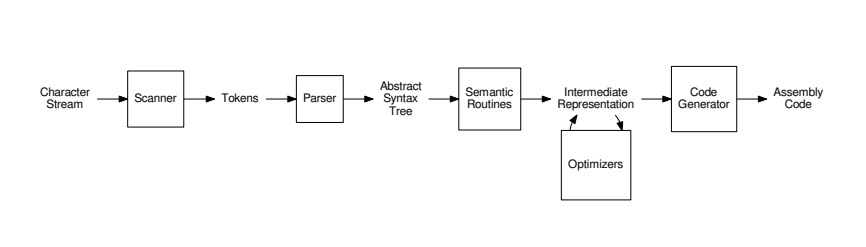
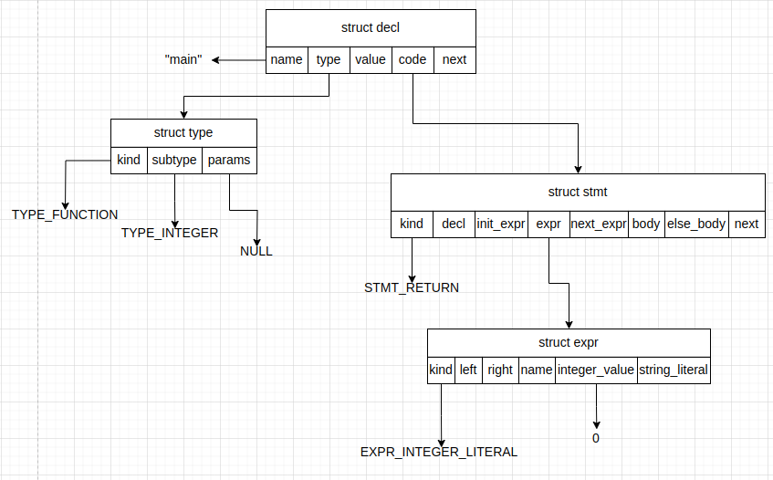

# Baikal Compiler

## Design



## Build
```bash
$ git clone https://github.com/adamsoliev/Baikal.git
$ cd Baikal/compiler 
$ make
```

## Scanner

```
enum TokenKind {
  KEYWORDS,
  IDENTIFIERS,
  NUMBERS,
  STRINGS,
  CHAR
}
```

```
Token {
    enum TokenKind kind;
}
```

## Parser 
It is a hand-coded recursive descent parser. It generates an AST using 5 types of nodes: decl, stmt, expr, type and param_list. Take a look at [baikalc.h](./baikalc.h) for more details.
```
int main() {
  return 0;
}
```
For the above code, the parser will generate the following AST:


## Semantic Routines
Here we do things like type checking

## Intermediate Representation


## Optimizers
Each optimizer (pass) takes in IR and returns optimized IR

## Code Generator
My initial plan is to target RV32I. 
Noteworthy things at this stage are register allocation, instruction selection and
sequencing.

