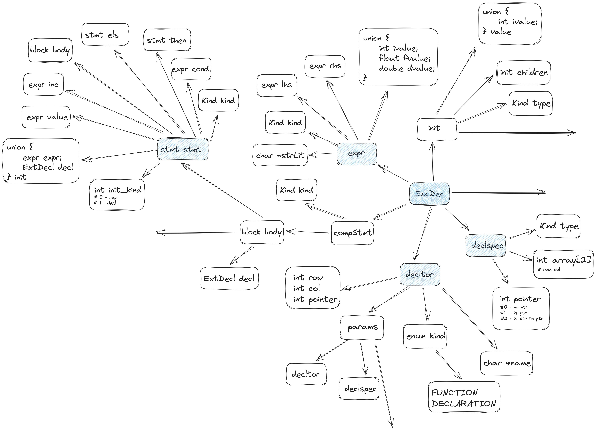

# Ganymede Compiler

## Design


Design principles
  1. Simplicity
  2. Modularity
  3. Testability

## FIXMES:
- Scan
  - Complete handling of numeric types in scan.c
- Parser
  - add special expr types (e_funcall, etc) instead of enum kind (opar, etc) 
  - improve error reporting in parser
    - add line number to error messages
  - improve AST printing 
    - rename nodes to better reflect subtree structure's meaning
    - refactor
  - make 'consume(token)' dynamic so that you can optionally mass error message
    - e.g. consume(INTCONST, "size of array has non-integer type %s", type_to_string(expr->type))
  - ensure precedence of operators is correct (e.g., a + b[i], *a-- + 23)

## Build
```bash
$ git clone https://github.com/adamsoliev/Ganymede.git
$ cd Ganymede/compiler 
$ make
```

## Data Structures


## Scanner
It is a hand-coded scanner that generates the following types of tokens:
```
enum TokenKind {
    TK_IDENT,    
    TK_NUM,      
    TK_KEYWORD,  
    TK_STR,      // string literal 
    TK_CHAR,     // character literal
    TK_PUNCT,    
    TK_ERROR,    
    TK_EOF,      
};
```
See [ganymede.h](./ganymede.h) and [scanner tests](./tests/scanner/) for more details.

## Parser 
It is a hand-coded recursive descent parser. It generates an AST using 5 types of nodes: decl, stmt, expr, type and param_list. 
See [ganymede.h](./ganymede.h) for more details.
```
int main() {
  return 0;
}
```
For the above code, the parser will generate the following AST:


AST is defined in terms of five C structures representing declarations, statements, expressions, types, and parameters.
- Declaration represents constants, variables, and functions. A complete program consists of a sequence of declarations. 
```
struct decl {
  char *name;
  struct type *type;
  struct expr *value; // value of expression
  struct stmt *code;  // body of function
  struct decl *next;
};
```

- Statement represents action items (computation, loop or branch) and a declaration of a local variable. A body of a function consists of a sequence of statements. 
```
struct stmt {
  stmt_t kind; // DECL, EXPR, IF, FOR, PRINT, RETURN, BLOCK
  struct decl *decl;
  struct expr *init_expr;
  struct expr *expr;
  struct expr *next_expr;
  struct stmt *body;
  struct stmt *else_body;
  struct stmt *next;
};
```

- Expression represents a computation that yields a value such as int, float or string. 
Special cases: 
  - Unary operators (like logical-not) have their sole argument in the left field. 
  - Funccall is constructed by creating an EXPR_CALL node, where the left field is the function name and the right is unbalanced tree of EXPR_ARGS nodes.
  - Array subscripting is treated like a binary operator, where the left field of the EXPR_SUBSCRIPT is the name of the array and the right field is the integer expression.
```
struct expr {
  expr_t kind; // UNOP, BINOP, FCALL, LITERAL, IDENT, SUBSCRIPT, DEREF, ADDR
  struct expr *left;
  struct expr *right;
  const char *name;
  int integer_value; // int, boolean and char
  const char *
  string_literal;
};
```

- Type represents the type of a variable or a function. Primitive types (int, boolean, etc) are expressed by simply setting the kind field. Compound types (array, function, etc) are built by connecting multiple type nodes together.
```
struct type {
  type_t kind;
  struct type *subtype; 
  struct param_list *params; 
};
```

- Parameter list represents the list of parameters of a function. 
```
struct param_list {
  char *name;
  struct type *type;
  struct param_list *next;
};
```

## Semantic Routines
- Name resolution 
- Type checking

## Intermediate Representation
[LLVM IR](https://llvm.org/docs/LangRef.html). It is a SSA based language that can represent 'all' modern high-level language constructs cleanly. It follows 'three address code' form and, hence, maps nicely to RISC-V assembly. 

## Optimizers
Implemented optimization passes (each takes in IR and returns optimized IR):
- Constant folding

## Code Generator
Ideally, I would like this part to consist of 3 separate stages: 
- instruction selection
- instruction scheduling 
- register allocation

Currently, however, the compiler directly maps IR to RISC-V assembly, essentially generating template-like code.


