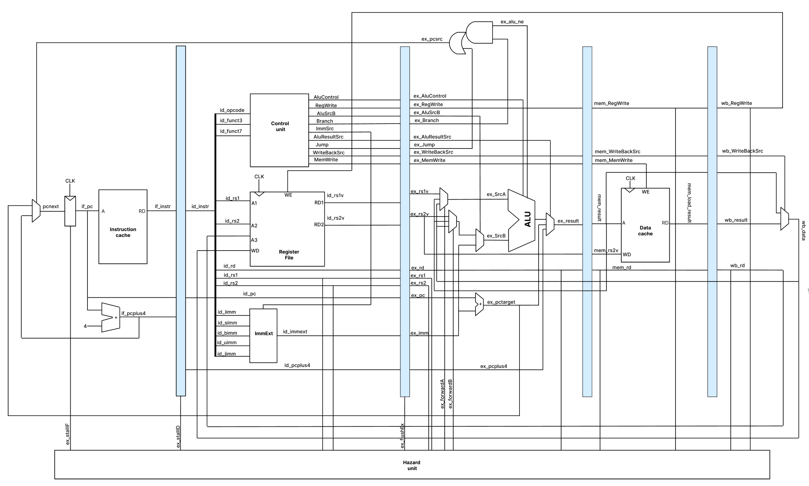

## Design

5-stage pipelined 64-bit RISC-V soft core
- Supported instructions: add, sub, sll, xor, or, and, bne, lui, auipc, jal, ld, sd
- Forwarding for RAW hazards
    - MEM   -> EX
    - WB    -> EX
    - WB    -> ID (implicitly through Register File)
- Stalling for load-use hazards
- Static 'not taken' branch predictor

