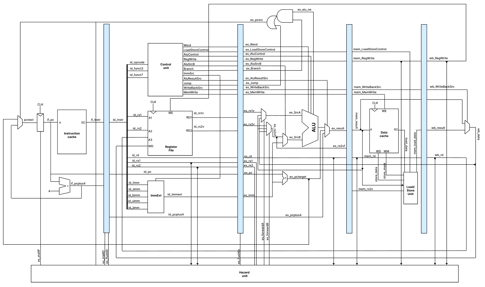

## Design

5-stage pipelined 64-bit RISC-V soft core
- Unsupported instructions: branches except bne and jalr
- Forwarding for RAW hazards
    - MEM   -> EX
    - WB    -> EX
    - WB    -> ID (implicitly through Register File)
- Stalling for load-use hazards
- Static 'not taken' branch predictor

