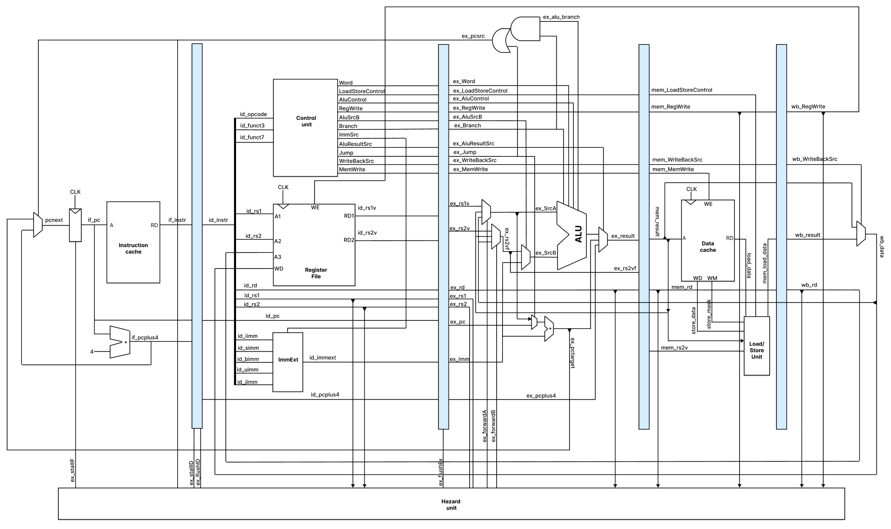

## Design

5-stage pipelined 64-bit RISC-V core
- Supported instructions: RV32I/RV64I
- Forwarding for RAW hazards
    - MEM   -> EX
    - WB    -> EX
    - WB    -> ID (implicitly through Register File)
- Stalling for load-use hazards
- Static 'not taken' branch predictor

## Resources
- Digital Design and Computer Architecture: RISC-V Edition
  > A well-written introductory text on microarchitecture of modern processors
- Computer Organization and Design: RISC-V Edition
  > A decent introductory text on overall computer organization 
- Computer Architecture: A Quantitative Approach
  > A bible of computer architecture
---
- [CORE-V Wally](https://github.com/openhwgroup/cvw)
  > Feature-rich RISC-V core with educational focus, written in SystemVerilog   
- [Muntjac](https://github.com/lowRISC/muntjac)
  > Minimalistic 64-bit RISC-V core with clean and well-tested design, written in SystemVerilog

